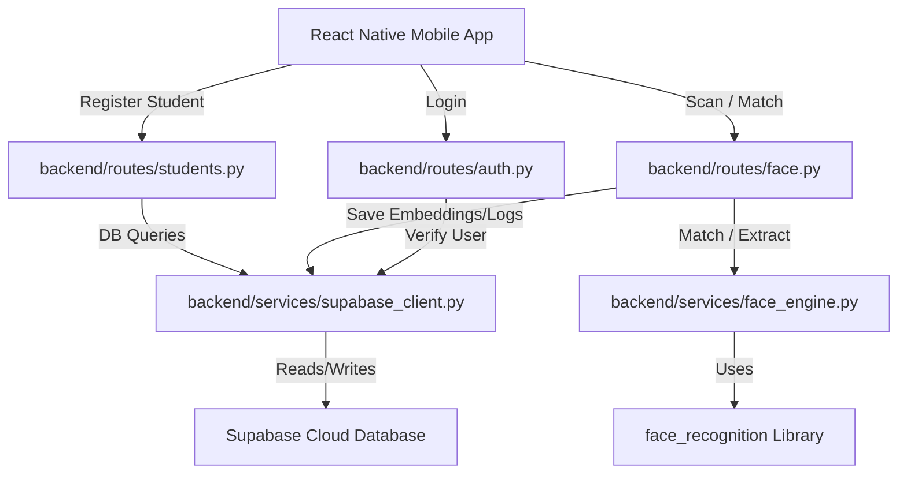

# Agent.md

## Project Overview
This project, **Hostel Biometric**, is a step-by-step implementation of a mobile biometric system for hostels using React Native (Expo) and a Python backend (FastAPI + face_recognition library) backed by Supabase for database storage. It consists of an Admin App (for registering students and enrolling faces) and a Guard App (for scanning faces and logging entries/exits).

---

## Workspace Directory Structure

Currently, the workspace is in the initial setup phase. The full structure will be established during the setup steps (specifically Step 2).

### Root Directory Files
* **[Agent.md](file:///Users/charankumar/Documents/Personal-Projects/My%20Projects/Face%20Biometric/Agent.md)**: Current file. Serves as the AI and human-readable guide to the repository structure and responsibilities.
* **[Progress.md](file:///Users/charankumar/Documents/Personal-Projects/My%20Projects/Face%20Biometric/Progress.md)**: Tracks the progress of each step, including completed steps, remaining steps, confidence scores, and summaries.
* **[StudentLearning.md](file:///Users/charankumar/Documents/Personal-Projects/My%20Projects/Face%20Biometric/StudentLearning.md)**: Educational documentation detailing what was done in each step, why, and the technical concepts used.
* **[AILearning.md](file:///Users/charankumar/Documents/Personal-Projects/My%20Projects/Face%20Biometric/AILearning.md)**: AI log of mistakes, corrections, user preferences, and lessons learned.
* **[AgentSkills.md](file:///Users/charankumar/Documents/Personal-Projects/My%20Projects/Face%20Biometric/AgentSkills.md)**: Maps project phases and individual steps to required agent skills.
* **[hostel_biometric_build_plan_v2.md](file:///Users/charankumar/Documents/Personal-Projects/My%20Projects/Face%20Biometric/hostel_biometric_build_plan_v2.md)**: The comprehensive 33-step master build plan.
* **[GEMINI.md](file:///Users/charankumar/Documents/Personal-Projects/My%20Projects/Face%20Biometric/GEMINI.md)**: Project instructions regarding required documentation files.
* **[frontend design prompts.md](file:///Users/charankumar/Documents/Personal-Projects/My%20Projects/Face%20Biometric/frontend%20design%20prompts.md)**: Structured system prompts for generating high-fidelity mobile designs using the RSCIT framework.

### Current Directory Structure
The project is organized into two main parts:
1. `backend/`: FastAPI Python server with the face recognition engine (folders and placeholder files created in Step 2).
2. `mobile/`: Expo React Native application (initialized with blank Expo template and core packages in Step 4).

#### 1. Backend (`backend/`)
* **[main.py](file:///Users/charankumar/Documents/Personal-Projects/My%20Projects/Face%20Biometric/backend/main.py)**: The entry point of the FastAPI application. Wires up all API routers and configures CORS middleware.
* **[test_face.py](file:///Users/charankumar/Documents/Personal-Projects/My%20Projects/Face%20Biometric/backend/test_face.py)**: Standalone proof-of-concept test script for verifying local `face_recognition` library operations.
* **[test_api.py](file:///Users/charankumar/Documents/Personal-Projects/My%20Projects/Face%20Biometric/backend/test_api.py)**: Automated end-to-end integration test script for all backend API endpoints.
* **[requirements.txt](file:///Users/charankumar/Documents/Personal-Projects/My%20Projects/Face%20Biometric/backend/requirements.txt)**: List of Python dependencies.
* **[Dockerfile](file:///Users/charankumar/Documents/Personal-Projects/My%20Projects/Face%20Biometric/backend/Dockerfile)**: Docker container configuration for compilation of C++ libraries (dlib/face_recognition) and production FastAPI hosting.
* **[.env](file:///Users/charankumar/Documents/Personal-Projects/My%20Projects/Face%20Biometric/backend/.env)**: Environment variables (Supabase credentials, secrets).
* **`routes/`**: Folder containing endpoint handlers.
  * **[__init__.py](file:///Users/charankumar/Documents/Personal-Projects/My%20Projects/Face%20Biometric/backend/routes/__init__.py)**: Standard package initialization file.
  * **[auth.py](file:///Users/charankumar/Documents/Personal-Projects/My%20Projects/Face%20Biometric/backend/routes/auth.py)**: Login endpoints for Admin and Guard using JWT.
  * **[students.py](file:///Users/charankumar/Documents/Personal-Projects/My%20Projects/Face%20Biometric/backend/routes/students.py)**: CRUD endpoints for student registration and details.
  * **[face.py](file:///Users/charankumar/Documents/Personal-Projects/My%20Projects/Face%20Biometric/backend/routes/face.py)**: Core endpoints for face enrollment, identification, and action logging.
  * **[outpass.py](file:///Users/charankumar/Documents/Personal-Projects/My%20Projects/Face%20Biometric/backend/routes/outpass.py)**: Endpoints for recent log history and currently out-of-hostel tracking.
* **`services/`**: Core logic and integrations.
  * **[face_engine.py](file:///Users/charankumar/Documents/Personal-Projects/My%20Projects/Face%20Biometric/backend/services/face_engine.py)**: Interface to `face_recognition` library for embedding extraction and matching.
  * **[supabase_client.py](file:///Users/charankumar/Documents/Personal-Projects/My%20Projects/Face%20Biometric/backend/services/supabase_client.py)**: Instantiates the Supabase client for database operations.
* **`models/`**: Data validations and schemas.
  * **[schemas.py](file:///Users/charankumar/Documents/Personal-Projects/My%20Projects/Face%20Biometric/backend/models/schemas.py)**: Pydantic models for API request/response validation.

#### 2. Mobile App (`mobile/`)
The client mobile application built with React Native and Expo. Key files and directories:
* **[App.js](file:///Users/charankumar/Documents/Personal-Projects/My%20Projects/Face%20Biometric/mobile/App.js)**: The entry point component of the mobile app.
* **[app.json](file:///Users/charankumar/Documents/Personal-Projects/My%20Projects/Face%20Biometric/mobile/app.json)**: Configuration manifest for Expo SDK (app name, icon, splash, native plugin configurations).
* **[package.json](file:///Users/charankumar/Documents/Personal-Projects/My%20Projects/Face%20Biometric/mobile/package.json)**: Declares all dependencies (React Navigation, Zustand, Expo Camera, Tailwind/NativeWind, etc.).
* **`assets/`**: Standard directory containing icons, splash screen image, and custom fonts.
* **`designs/`**: Contains the 8 high-fidelity reference screen layouts generated from the design system.
* **`store/`**: Global state management.
  * **[useStore.js](file:///Users/charankumar/Documents/Personal-Projects/My%20Projects/Face%20Biometric/mobile/store/useStore.js)**: Zustand store that handles authentication and session state, synchronized with hardware keychain storage.
* **`services/`**: Network communication layer.
  * **[api.js](file:///Users/charankumar/Documents/Personal-Projects/My%20Projects/Face%20Biometric/mobile/services/api.js)**: Axios HTTP request client configuring automatic authentication injection and token validation.
* **`screens/`**: Application screen components (React Navigation, not expo-router).
  * **[LoginScreen.js](file:///Users/charankumar/Documents/Personal-Projects/My%20Projects/Face%20Biometric/mobile/screens/LoginScreen.js)**: Unified login screen for admin and guard users. Matches Stitch design reference.
  * **[AdminDashboardScreen.js](file:///Users/charankumar/Documents/Personal-Projects/My%20Projects/Face%20Biometric/mobile/screens/AdminDashboardScreen.js)**: Home view for hostel administrators showing statistics metrics and live entry logs.
  * **[RegisterStudentScreen.js](file:///Users/charankumar/Documents/Personal-Projects/My%20Projects/Face%20Biometric/mobile/screens/RegisterStudentScreen.js)**: Profile registration form allowing admins to create resident records before capturing biometric templates.
  * **[FaceEnrollmentScreen.js](file:///Users/charankumar/Documents/Personal-Projects/My%20Projects/Face%20Biometric/mobile/screens/FaceEnrollmentScreen.js)**: Live camera interface utilizing expo-camera to register 3 face profile perspectives of a resident.
  * **[StudentListScreen.js](file:///Users/charankumar/Documents/Personal-Projects/My%20Projects/Face%20Biometric/mobile/screens/StudentListScreen.js)**: Scrollable directory roster displaying registered students and their biometric registration status.
  * **[AdminTabNavigator.js](file:///Users/charankumar/Documents/Personal-Projects/My%20Projects/Face%20Biometric/mobile/screens/AdminTabNavigator.js)**: Nested bottom tab navigator hosting the admin dashboard, registration form, and roster screens.
  * **[GuardScanScreen.js](file:///Users/charankumar/Documents/Personal-Projects/My%20Projects/Face%20Biometric/mobile/screens/GuardScanScreen.js)**: Core guard verification camera screen. Captures face frames, performs 1:N identification via backend API, and displays match results in an inline modal overlay.
  * **[StudentFoundModalScreen.js](file:///Users/charankumar/Documents/Personal-Projects/My%20Projects/Face%20Biometric/mobile/screens/StudentFoundModalScreen.js)**: Action confirmation drawer screen that appears after identification. Displays student profile metadata, match confidence percentage, IN/OUT activity logging buttons, and warning cards for unknown persons.
  * **[RecentLogsScreen.js](file:///Users/charankumar/Documents/Personal-Projects/My%20Projects/Face%20Biometric/mobile/screens/RecentLogsScreen.js)**: Guard activity ledger feed. Displays live check-in and check-out logs grouped chronologically by date sections, featuring pull-to-refresh actions and status badges.
  * **[GuardTabNavigator.js](file:///Users/charankumar/Documents/Personal-Projects/My%20Projects/Face%20Biometric/mobile/screens/GuardTabNavigator.js)**: Bottom tab navigator hosting the guard camera verification scanner and recent activity ledger.

---

## File Relationships and Data Flow

