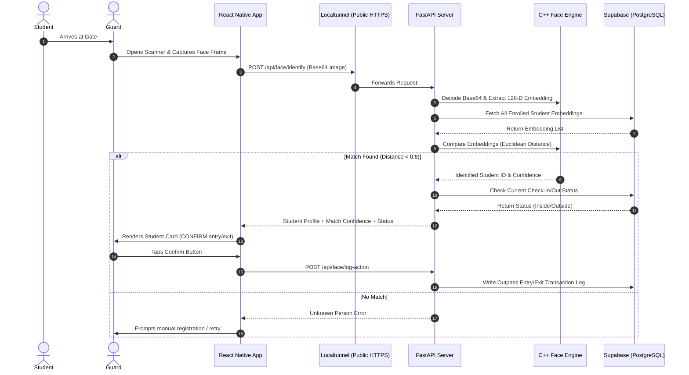

# 🏫 Hostel Biometric Security & Outpass System

A high-performance biometric security and digital outpass management system designed for student hostels. This system uses **1:N facial recognition** to automate student check-ins and check-outs at hostel gates.

📘 **For detailed feature instructions and user guides, see the [USER_MANUAL.md](USER_MANUAL.md)**.

---

## ⚡ Quick & Simple Setup Guide (Non-Technical)

Follow these simple steps to run the backend on your computer, create the public network tunnel, and run the mobile app.

### 1️⃣ Step 1: Start the Backend Server
Open your computer terminal and run:
```bash
cd backend
./venv/bin/python3 -m uvicorn main:app --host 0.0.0.0 --port 8000
```
*(Windows: `venv\Scripts\python.exe -m uvicorn main:app --host 0.0.0.0 --port 8000`)*

✅ Keep this terminal window open.

---

### 2️⃣ Step 2: Start the Localtunnel
Open a **second terminal window** and run:
```bash
npx localtunnel --port 8000 --subdomain hostel-biometric-charan
```
✅ Your local backend is now securely accessible at `https://hostel-biometric-charan.loca.lt`. Keep this window open.

---

### 3️⃣ Step 3: Run Mobile App or Install APK

#### Option A: Install Standalone Android APK (Recommended)
1. Copy the pre-compiled `hostel-biometric.apk` file from the project root to your Android phone.
2. Tap the file to install it.
3. Open the app and log in!

#### Option B: Run via Expo Go
1. Open a **third terminal window** and run:
   ```bash
   cd mobile
   npx expo start
   ```
2. Scan the QR code using the **Expo Go** app on your phone.

---

## 🔑 Login Accounts

| Role | Default Email | Access & Permissions |
|------|---------------|----------------------|
| **Admin** | `admin@nitw.edu` | Register students, enroll faces (3-photo capture), view roster & hostel analytics |
| **Guard** | `guard@nitw.edu` | Live face scanner, log entries/exits, view access ledger & outside students list |

---

## 📱 How the System Works



### Core Architecture
1. **React Native Mobile App (Expo)**: Provides unified login for Admin and Guard roles using Zustand state management and React Navigation.
2. **FastAPI Backend (Python)**: High-throughput API server with `CollegeCache` for zero-latency lookups.
3. **Face Recognition Engine (`dlib` + OpenCV)**: Extracts 128-dimensional biometric face embeddings and runs vectorized distance comparisons.
4. **Supabase Database (PostgreSQL)**: Stores student profiles, embeddings, and real-time gate transaction outpass logs.

---

## 🛠️ Project Structure

```
├── backend/
│   ├── main.py              # FastAPI app entry point & CORS
│   ├── requirements.txt      # Python dependencies
│   ├── routes/               # API endpoints (auth, students, face, outpass)
│   └── services/             # Supabase client, Face Engine, CollegeCache
├── mobile/
│   ├── App.js                # React Navigation root
│   ├── package.json          # Mobile dependencies
│   ├── store/                # Zustand global state
│   ├── components/           # Reusable UI modals (StudentDetailsModal)
│   └── screens/              # Admin and Guard screens
├── USER_MANUAL.md            # Detailed user manual & setup instructions
└── hostel-biometric.apk      # Standalone Android APK
```

---

## 🏗️ Rebuilding the Android APK (Advanced)

If you modify mobile source code and wish to recompile the release APK:

```bash
cd mobile
npx expo prebuild --platform android --clean --no-install
echo "sdk.dir=$HOME/Library/Android/sdk" > android/local.properties
cd android
./gradlew assembleRelease
cp app/build/outputs/apk/release/app-release.apk ../../hostel-biometric.apk
```

The fresh APK will be placed at the project root: `hostel-biometric.apk`.
