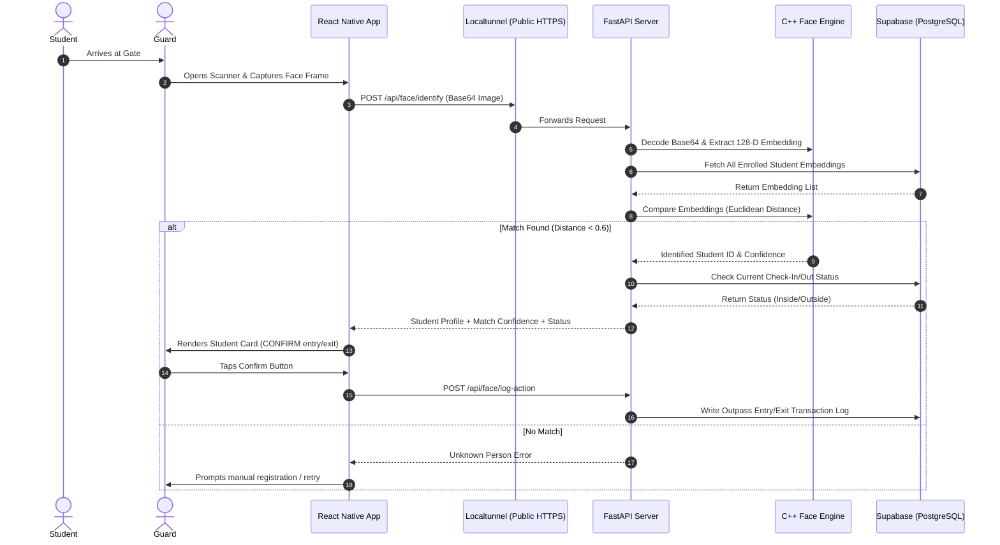

# Hostel Biometric Security & Outpass System

A high-performance biometric security and digital outpass management system designed for student hostels. This system uses **1:N facial recognition** to automate student check-ins and check-outs at the gates.

---

## 📱 How the System Works



### Core Architecture
1. **React Native Mobile App (Expo)**: Provides a single application with two roles (Admin and Guard). Protects layouts using Zustand state management and routes views via React Navigation.
2. **FastAPI Backend (Python)**: Acts as the high-throughput gateway. Decodes image payloads, interfaces with the C++ face recognition engine, and signs JWT tokens.
3. **Face Recognition Engine (`dlib` + OpenCV)**: Loads incoming images, detects bounding boxes using HOG (Histogram of Oriented Gradients), and projects the face onto a 128-dimensional vector space (embedding). Matches are found by calculating the Euclidean distance between vectors.
4. **Supabase Database (PostgreSQL)**: Serves as the storage layer, utilizing PostgreSQL array types to store the 128-D vector embeddings, enabling fast matching queries.

---

## 🛠️ Project Structure

```
├── backend/
│   ├── main.py              # FastAPI app configuration, CORS, and endpoint registrations
│   ├── requirements.txt      # Python dependencies (dlib, face-recognition, supabase, jose)
│   ├── Dockerfile            # Container configuration for remote builds
│   ├── routes/               # API Router endpoints (auth, students, face, outpass)
│   └── services/             # Supabase database client & C++ Face Recognition engine
├── mobile/
│   ├── App.js                # React Navigation configuration and root entry
│   ├── app.json              # Expo application manifest, package names, permissions
│   ├── package.json          # React Native dependencies
│   ├── store/                # Zustand global state (authentication, tokens, roles)
│   ├── services/             # Axios API client setup (with localtunnel bypass headers)
│   └── screens/              # UI screens (Admin Dashboard, Enrollment, Scan, Logs, Roster)
└── hostel-biometric.apk      # Pre-compiled, standalone Android APK
```

---

## 💾 Step 1: Supabase Database Setup

Set up your database instance by running these queries in the **Supabase SQL Editor**:

```sql
-- 1. Users Table (Hostel staff / admins / guards)
CREATE TABLE users (
    id UUID PRIMARY KEY DEFAULT gen_random_uuid(),
    email TEXT UNIQUE NOT NULL,
    role TEXT CHECK (role IN ('admin', 'guard')) NOT NULL,
    college_name TEXT NOT NULL,
    created_at TIMESTAMP WITH TIME ZONE DEFAULT timezone('utc'::text, now()) NOT NULL
);

-- 2. Students Table
CREATE TABLE students (
    id UUID PRIMARY KEY DEFAULT gen_random_uuid(),
    user_id UUID REFERENCES users(id) ON DELETE CASCADE NOT NULL,
    name TEXT NOT NULL,
    roll_number TEXT UNIQUE NOT NULL,
    department TEXT NOT NULL,
    year INTEGER NOT NULL,
    room_number TEXT NOT NULL,
    phone TEXT NOT NULL,
    is_enrolled BOOLEAN DEFAULT false NOT NULL,
    photo_url TEXT,
    created_at TIMESTAMP WITH TIME ZONE DEFAULT timezone('utc'::text, now()) NOT NULL
);

-- 3. Face Embeddings Table (Stores 128-D float arrays)
CREATE TABLE face_embeddings (
    id UUID PRIMARY KEY DEFAULT gen_random_uuid(),
    student_id UUID REFERENCES students(id) ON DELETE CASCADE NOT NULL,
    embedding double precision[] NOT NULL,
    created_at TIMESTAMP WITH TIME ZONE DEFAULT timezone('utc'::text, now()) NOT NULL
);

-- 4. Outpass Logs Table (Tracks gate entry/exit)
CREATE TABLE outpass_logs (
    id UUID PRIMARY KEY DEFAULT gen_random_uuid(),
    student_id UUID REFERENCES students(id) ON DELETE CASCADE NOT NULL,
    action TEXT CHECK (action IN ('IN', 'OUT')) NOT NULL,
    confidence double precision NOT NULL,
    logged_by UUID REFERENCES users(id) ON DELETE SET NULL,
    gate TEXT NOT NULL,
    timestamp TIMESTAMP WITH TIME ZONE DEFAULT timezone('utc'::text, now()) NOT NULL
);

-- 5. Seed Users (Mandatory to log into the mobile app)
INSERT INTO users (email, role, college_name) VALUES
('admin@college.edu', 'admin', 'National Institute of Technology'),
('guard@college.edu', 'guard', 'National Institute of Technology');
```

---

## ⚙️ Step 2: Backend Localhost Setup

Run the Python API server locally on your computer.

### Prerequisites
- Python **3.10 to 3.12** installed.
- C++ Compiler installed (Xcode Command Line Tools on macOS or Build Tools for Visual Studio on Windows) — required to compile the `dlib` library.

### Installation & Run
1. Navigate to the backend directory:
   ```bash
   cd backend
   ```

2. Create a virtual environment:
   ```bash
   python3 -m venv venv
   source venv/bin/activate  # On Windows: venv\Scripts\activate
   ```

3. Install dependencies:
   ```bash
   # Crucial on newer Python environments to prevent face_recognition compilation issues
   pip install "setuptools<70"
   pip install -r requirements.txt
   ```

4. Configure the environment files:
   Create a `.env` file inside the `backend/` folder:
   ```env
   SUPABASE_URL=https://your-project-ref.supabase.co
   SUPABASE_KEY=your-supabase-service-role-key
   SECRET_KEY=generate-a-secure-random-jwt-key
   ```

5. Run the FastAPI development server:
   ```bash
   venv/bin/python -m uvicorn main:app --host 0.0.0.0 --port 8000
   ```

### Troubleshooting: Port 8000 is Already in Use
If uvicorn fails with `[Errno 48] address already in use`, terminate the process running on that port:
- **macOS / Linux**:
  ```bash
  kill -9 $(lsof -t -i:8000)
  ```
- **Windows (PowerShell)**:
  ```powershell
  Stop-Process -Id (Get-NetTCPConnection -LocalPort 8000).OwningProcess -Force
  ```

---

## 🌐 Step 3: Localtunnel Setup (Public URL)

Since mobile phones (including the Android APK) cannot access `localhost:8000` directly over the cellular network, you must expose your local backend server using Localtunnel:

1. Open a **new terminal tab** and run:
   ```bash
   npx localtunnel --port 8000 --subdomain hostel-biometric-charan
   ```
2. The URL will always be: **`https://hostel-biometric-charan.loca.lt`**.
3. Keep this terminal running. If the tunnel disconnects, simply re-run the command above to bring it back online.

---

## 📱 Step 4: Mobile Setup & APK Compilation

Build the standalone Android app (`.apk`) so it can be installed on physical devices.

### 1. JDK 17 & Android SDK Setup
To compile native applications, you must install JDK 17 (Zulu JDK 17 is recommended):
```bash
# macOS
brew install --cask zulu@17
```
Configure your environment variables by adding these lines to your terminal profile (`~/.zshrc` or `~/.bash_profile`):
```bash
export JAVA_HOME=/Library/Java/JavaVirtualMachines/zulu-17.jdk/Contents/Home
export ANDROID_HOME=$HOME/Library/Android/sdk
export PATH=$JAVA_HOME/bin:$ANDROID_HOME/platform-tools:$PATH
```
Reload your profile: `source ~/.zshrc`

### 2. Configure API Endpoint in Code
1. Open `mobile/services/api.js`.
2. Replace `API_URL` with your live Localtunnel URL:
   ```javascript
   export const API_URL = 'https://your-localtunnel-url.loca.lt';
   ```
   *Note: Ensure the `headers: { 'Bypass-Tunnel-Reminder': 'true' }` configuration is kept in the axios client to prevent Localtunnel from displaying its warning interstitial.*

### 3. Generate Android Project & Build APK
1. Navigate to the mobile directory:
   ```bash
   cd mobile
   ```
2. Install npm modules:
   ```bash
   npm install
   ```
3. Generate the native Android Gradle project:
   ```bash
   npx expo prebuild --platform android --clean --no-install
   ```
4. Build the release APK:
   ```bash
   cd android
   ./gradlew assembleRelease
   ```
   *Tip: If the build fails with connection timeouts, connect your laptop to a mobile hotspot to bypass firewalls blocking Maven Central.*

5. The built APK will be ready at:
   `mobile/android/app/build/outputs/apk/release/app-release.apk`
   *(A copy has been placed at the project root: `hostel-biometric.apk`)*

---

## 📲 Installing & Logging In

1. Copy the `hostel-biometric.apk` to your Android device.
2. Tap the file to install (approve "Install from Unknown Sources" if prompted).
3. Open the app and log in using the seed accounts you inserted:
   - **Admin Portal**: Log in using `admin@college.edu`
   - **Guard Portal**: Log in using `guard@college.edu`
